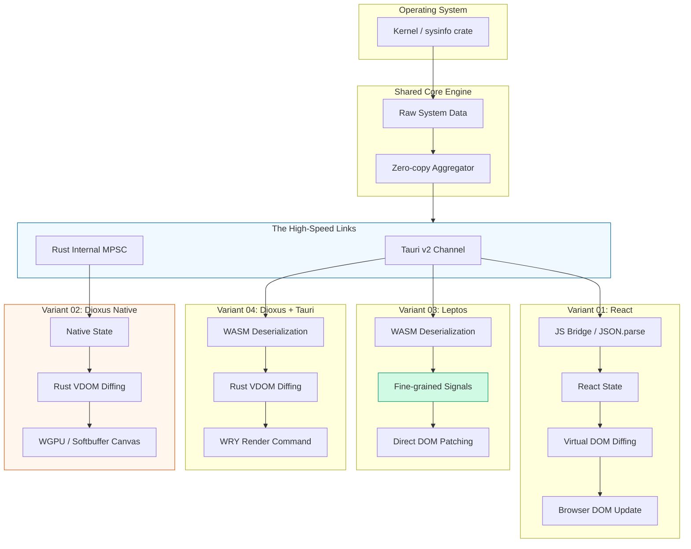

## Usage

```bash
# Foundation step
mkdir -p rust-pulse/core-engine
mkdir -p rust-pulse/variants
mkdir -p rust-pulse/benches-suite
cd rust-pulse
touch Cargo.toml
cargo init core-engine --lib

# Step 1
mkdir -p variants/01-tauri-react
cd variants/01-tauri-react
npm create vite@latest . -- --template react-ts
npm install
npx @tauri-apps/cli init
# name: rust-pulse-react
# title: Rust Pulse
# link: ../dist
# url: http://localhost:5173
npm install @tauri-apps/api
npm run dev # 1st terminal
npx @tauri-apps/cli dev # 2nd terminal
npm run tauri dev # or ~2nd
```

## Kiến trúc Hệ thống



## Cấu trúc Thư mục Dự án

```markdown
rust-pulse/
├── Cargo.toml # [1] Workspace Root (Version Orchestrator)
├── core-engine/ # [2] Shared Core (Framework Agnostic)
│ ├── Cargo.toml
│ └── src/
│ ├── lib.rs # Entry point, exports Traits
│ ├── models.rs # Zero-copy structs (Cow, serde borrow)
│ └── monitor.rs # Sysinfo implementation
│
├── variants/ # [3] UI Implementations (Isolated Shells)
│ ├── 01-tauri-react/ # Mỗi thư mục là một "Mini-project" hoàn chỉnh
│ │ ├── src-tauri/ # Backend shell cho React
│ │ │ ├── Cargo.toml # Trỏ về ../../../core-engine
│ │ │ └── src/main.rs
│ │ ├── src/ # React frontend
│ │ └── tauri.conf.json
│ │
│ ├── 02-dioxus-native/ # Pure Rust Binary
│ │ ├── Cargo.toml # Chứa dependencies riêng cho WGPU/Render
│ │ └── src/main.rs # Dùng mpsc channel lấy data từ core-engine
│ │
│ ├── 03-tauri-leptos/ # Rust Fullstack
│ │ ├── src-tauri/  
│ │ └── src/ # Leptos (WASM)
│ │
│ └── 04-tauri-dioxus/ # VDOM + Tauri
│ ├── src-tauri/
│ └── src/ # Dioxus (WASM)
│
├── benches-suite/ # [4] Tools & Metrics
│ ├── Cargo.toml
│ └── src/main.rs # Tool viết bằng Rust để đo đạc chỉ số các process khác
└── README.md
```

## Điểm nhấn Kỹ thuật (Staff Insights):

3 "vũ khí" chiến lược nổi bật:

1. Zero-copy Data Pipeline: Sử dụng serde(borrow) và Cow<'a, str> để dữ liệu từ Kernel được truyền thẳng tới Frontend mà không bị nhân bản vô tội vạ trong RAM.
2. Generic Data Provider: Thiết kế Trait DataProvider cho phép hệ thống chạy ở 2 chế độ: RealTime (đọc từ OS) và BenchmarkMode (đọc từ tập dữ liệu mẫu cố định để so sánh tính chuẩn xác giữa các UI).
3. IPC vs Native Latency: Đo lường sự chênh lệch (overhead) khi dữ liệu đi qua Wry/Webview (Tauri) so với việc render trực tiếp trên WebGPU/Softbuffer (Dioxus Native).
4. Leptos (Variant 03) - The "Surgical" Update:

- Cơ chế: Dữ liệu từ IPC cập nhật thẳng vào các Signals.
- Tại sao nhanh: Nó không chạy lại toàn bộ function để Diffing. Nó "phẫu thuật" (patch) đúng Node cần thay đổi trong DOM. Đây là điểm mấu chốt để bạn so sánh với React.

4. Dioxus Native (Variant 02) - The "Bypass" Route:

- Cơ chế: Bỏ qua hoàn toàn JSON Serialization. Dữ liệu đi qua MPSC vẫn giữ nguyên định dạng của Rust.
- Tại sao nhanh: Không tốn tài nguyên cho Webview (WRY). Nó vẽ trực tiếp lên Screen buffer bằng GPU. Đây là "Baseline" thực sự của hiệu suất.

5. Tauri + Dioxus (Variant 04) vs React (Variant 01):

- Cả hai đều dùng Virtual DOM, nhưng Dioxus chạy VDOM bằng Rust (WASM), còn React chạy bằng JS.
- Bài benchmark của bạn sẽ trả lời được câu hỏi: "VDOM của Rust có thực sự thắng được VDOM cực kỳ tối ưu của React hay không khi chạy trong Webview?"

## Lộ trình Triển khai (Roadmap)

Để lộ trình thông suốt và có sản phẩm chạy thử (MVP) sớm nhất, tôi đề xuất thứ tự sau:

- Bước 1: Core Engine Development (The Foundation). Xây dựng logic polling và cấu trúc dữ liệu Zero-copy. Đây là nguồn sống cho toàn bộ app.
- Bước 2: Tauri v2 IPC Integration. Thiết lập Channel truyền tin. Tại đây, ta sẽ hoàn thiện biến thể 01 (React) để làm mốc so sánh (Baseline).
- Bước 3: Native Rendering (The Challenger). Triển khai 02 (Dioxus Native) để thấy sức mạnh tối đa của Rust khi không có Webview.
- Bước 4: WASM Variants (The Optimizers). Triển khai 03 & 04 để so sánh Signal vs VDOM trong môi trường Tauri.
- Bước 5: Benchmarking & Final Report. Chạy suite đo lường và viết báo cáo phân tích.

### Tổng quan Bước 1: Core Engine Development

| Bước con | Tên gọi             | Nhiệm vụ chính                                    | Tại sao quan trọng?                                                            |
| -------- | ------------------- | ------------------------------------------------- | ------------------------------------------------------------------------------ |
| 1.1      | Data Modeling       | Định nghĩa Structs với Cow<'a, str> và serde.     | Đảm bảo dữ liệu nhẹ nhất khi đi qua đường ống IPC.                             |
| 1.2      | The Collector Logic | Triển khai SystemMonitor sử dụng sysinfo.         | Tối ưu hóa việc quét CPU/RAM (không quét lại toàn bộ nếu không cần thiết).     |
| 1.3      | Async Polling Loop  | Thiết lập vòng lặp tokio::spawn và mpsc::channel. | Giữ cho việc thu thập dữ liệu chạy ngầm, không chặn (block) luồng xử lý chính. |

#### Chi tiết kế hoạch cho Bước 1.2 & 1.3:

Trong phần tiếp theo, chúng ta sẽ viết theo hướng Trait-based (Dựa trên giao diện chung):

1. Thiết lập Models (Zero-copy):
1. Thiết kế DataProvider Trait: \* Giúp bạn có thể tạo RealTimeProvider (lấy dữ liệu từ máy thật) và MockProvider (dữ liệu giả để benchmark sự ổn định của UI).
1. Quản lý Lifetime trong monitor.rs:

- Thử thách lớn nhất ở đây là sysinfo::System sở hữu (own) dữ liệu, nhưng SystemPulse<'a> lại mượn (borrow) dữ liệu đó.
- Chúng ta sẽ cần một kỹ thuật gọi là Self-referential struct hoặc đơn giản hơn là đảm bảo System object sống đủ lâu trong vòng lặp Polling.

### Tổng quan Bước 2: Tauri v2 IPC & Baseline

Giai đoạn này được chia thành 3 bước con chiến lược:

| Bước con | Tên gọi                       | Nhiệm vụ chính (Staff Insights)                                               | Mục tiêu hiệu suất                                            |
| -------- | ----------------------------- | ----------------------------------------------------------------------------- | ------------------------------------------------------------- |
| 2.1      | Tauri v2 Shell Setup          | Khởi tạo dự án Tauri v2 bên trong variants/01-tauri-react.                    | Cấu hình allowlist tối giản để giảm size binary.              |
| 2.2      | The IPC Pipe (Channels)       | Thiết lập tauri::ipc::Channel để stream dữ liệu liên tục thay vì dùng invoke. | Giảm overhead của việc khởi tạo request/response liên tục.    |
| 2.3      | React Baseline (The Consumer) | Sử dụng useEffect để lắng nghe Channel và render danh sách tiến trình.        | Đo lường mức CPU/RAM tiêu thụ của Webview làm mốc tham chiếu. |

#### Các thách thức kỹ thuật tại Bước 2

Tại bước này, chúng ta sẽ tập trung xử lý "cái giá phải trả" khi dùng Webview:

- Serialization Bottleneck: Dữ liệu từ Rust (SystemPulse) phải được biến thành JSON string để JS có thể đọc. Chúng ta sẽ tối ưu bằng cách sử dụng serde-json kết hợp với Zero-copy mà chúng ta đã làm ở Bước 1.
- Frequency Tuning: Nếu gửi dữ liệu quá nhanh (ví dụ 60fps), JS Bridge sẽ bị nghẽn (congested). Chúng ta sẽ thiết kế cơ chế Throttling (ví dụ: 2Hz - 500ms/lần) để đảm bảo UI mượt mà nhưng không làm quá tải CPU.
- State Management Overhead: Trong React, việc cập nhật một mảng hàng trăm phần tử vào State có thể gây ra hiện tượng Re-render không cần thiết. Chúng ta sẽ thảo luận về React.memo hoặc Virtual Lists để đảm bảo Baseline của chúng ta là một bản cài đặt "tốt nhất có thể" (Best-practice).

#### Staff Insight: Tại sao chọn React làm Baseline?

Trong giới Staff Engineer, chúng ta chọn React/JS làm mốc so sánh vì nó đại diện cho "Standard Industry Practice" (Cách làm phổ biến nhất).

- Nếu biến thể Leptos (Rust Native UI) không nhanh hơn React đáng kể, thì việc đầu tư vào Leptos là không hiệu quả về mặt kinh tế (Development Cost).
- Biến thể này giúp bạn trả lời câu hỏi: "Liệu sức mạnh của Rust ở Backend có bị triệt tiêu bởi overhead của JavaScript ở Frontend không?"

### Tổng quan Bước 3: Native Rendering & Direct Memory Access

Giai đoạn này tập trung vào việc tối ưu hóa đường truyền nội bộ giữa Core và UI trong cùng một tiến trình (Process).

| Bước con | Tên gọi                  | Nhiệm vụ chính (Staff Insights)                       | Mục tiêu hiệu suất                                              |
| -------- | ------------------------ | ----------------------------------------------------- | --------------------------------------------------------------- |
| 3.1      | Dioxus Desktop Setup     | Khởi tạo Dioxus với renderer wgpu hoặc softbuffer.    | Loại bỏ hoàn toàn RAM của Webview (thường tiết kiệm >100MB).    |
| 3.2      | Internal MPSC Bridge     | Thay thế Tauri Channel bằng tokio::sync::mpsc.        | Zero-serialization: Truyền trực tiếp Pointer/Reference dữ liệu. |
| 3.3      | Native UI Implementation | Xây dựng UI bằng Dioxus Components (Rust-based VDOM). | Đạt mức 60 FPS ổn định với CPU usage cực thấp.                  |

#### Staff Insight: Tại sao đây là "The Challenger"?

Trong các báo cáo kiến trúc, biến thể này đóng vai trò là "Performance Ceiling" (Trần hiệu năng).

- Nó cho chúng ta biết: "Nếu bỏ qua mọi rào cản về công nghệ Web, đây là tốc độ nhanh nhất mà phần cứng có thể đạt được".
- Kết quả từ Bước 3 sẽ giúp bạn đánh giá xem 2 biến thể tiếp theo (Leptos/Dioxus trên Tauri) bị chậm đi bao nhiêu % do Webview.

### Tổng quan Bước 4: So sánh Leptos và Dioxus (WASM)

Giai đoạn này tập trung vào việc tối ưu hóa cách UI "tiêu thụ" và "phản ứng" với dữ liệu từ Rust Core.

| Bước con | Tên gọi                     | Nhiệm vụ chính (Staff Insights)                        | Mục tiêu hiệu suất                                                    |
| -------- | --------------------------- | ------------------------------------------------------ | --------------------------------------------------------------------- |
| 4.1      | Leptos (Signals) Setup      | Cài đặt Leptos với mô hình Reactive (Fine-grained).    | Tránh Re-render toàn bộ component; chỉ cập nhật đúng con số thay đổi. |
| 4.2      | Dioxus (VDOM) Setup         | Cài đặt Dioxus với mô hình Virtual DOM trong WASM.     | So sánh tốc độ Diffing của Rust VDOM so với React VDOM (JS).          |
| 4.3      | Binary Payload Optimization | Sử dụng Bincode hoặc MessagePack thay vì JSON qua IPC. | Giảm thiểu chi phí Parse dữ liệu tại Frontend WASM.                   |

### Tổng quan Bước 5: Đo lường, Phân tích & Case Study

Giai đoạn này tập trung vào tính khách quan và khả năng quan sát hệ thống (Observability).

| Bước con | Tên gọi                | Nhiệm vụ chính (Staff Insights)                                        | Kết quả đầu ra                                         |
| -------- | ---------------------- | ---------------------------------------------------------------------- | ------------------------------------------------------ |
| 5.1      | Instrumentation        | "Gắn các ""cảm biến"" đo đạc vào từng biến thể (CPU/RAM/Binary Size)." | Dataset thô (CSV/JSON) của 4 biến thể.                 |
| 5.2      | Stress Testing         | Chạy polling ở tần suất cực cao (ví dụ: 10ms/lần) để ép xung IPC.      | Biểu đồ về sự ổn định (Stability) và độ trễ (Latency). |
| 5.3      | Data Visualization     | Chuyển đổi số liệu thành biểu đồ so sánh trực quan.                    | Dashboard so sánh hiệu năng.                           |
| 5.4      | "The ""Why"" Analysis" | Viết báo cáo giải thích nguyên nhân kỹ thuật đằng sau các con số.      | Tài liệu Case Study hoàn chỉnh (Staff-level).          |

#### Các kỹ thuật đo lường chiến lược (Staff Level)

Trong bước này, chúng ta không dùng Task Manager để xem RAM một cách thủ công. Chúng ta sẽ:

- Sử dụng benches-suite: Một tool Rust/Python riêng biệt để lấy chỉ số RSS (Resident Set Size) và PSS (Proportional Set Size) của từng process biến thể. Điều này loại bỏ sai số do bản thân việc đo đạc gây ra.
- Frame-time Analysis: Đo thời gian từ lúc dữ liệu rời Core đến khi UI thực sự render xong một Frame. Đây là chỉ số quan trọng nhất cho UX.
- Cold Start vs. Warm Start: So sánh thời gian khởi động của bản Native (Dioxus) so với các bản Tauri (phụ thuộc vào Webview engine).

#### Staff Insight: Giá trị của bài Report

> "Mặc dù Leptos có độ trễ IPC tương đương React, nhưng mức tiêu thụ CPU Baseline thấp hơn 12% nhờ cơ chế Fine-grained Reactivity, giúp kéo dài tuổi thọ pin cho các thiết bị di động khi chạy System Monitor ngầm."
